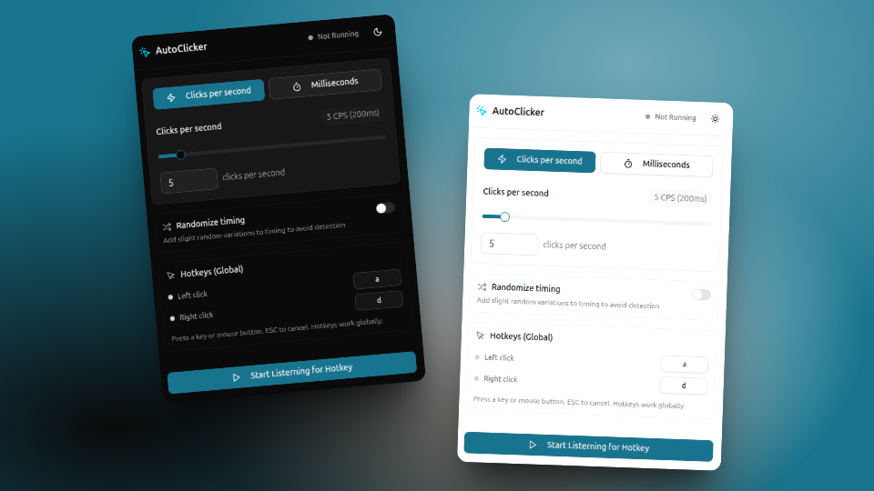

# AutoClicker

> ⚠️ **Note:**  
> Mouse button hotkeys are currently supported **only on Windows**. Keyboard hotkeys work across all platforms.

---

## 💡 About

AutoClicker is a simple, powerful, and cross-platform auto-clicker built with a modern UI. I created this because I couldn't find an open-source alternative with all the features I wanted.

---

## ✨ Features

- **Hotkeys:** Start and stop clicking with customizable keyboard shortcuts  
- **CPS (Clicks Per Second):** Set and monitor your click speed in real-time

---

## 🛠 Tech Stack

- **[Tauri](https://tauri.app/):** Cross-platform desktop app framework  
- **[Enigo](https://github.com/enigo-rs/enigo):** Rust library for simulating input  
- **[Device_Query](https://github.com/benjamin-hodgson/device_query):** Detects input events  
- **[shadcn/ui](https://ui.shadcn.com/):** Modern UI components  
- **[Tailwind CSS](https://tailwindcss.com/):** Utility-first CSS framework

---

## 🖥 Compatibility

- ✅ Windows  
- ✅ Linux (X11)  
- ⚠️ Mac (untested)
